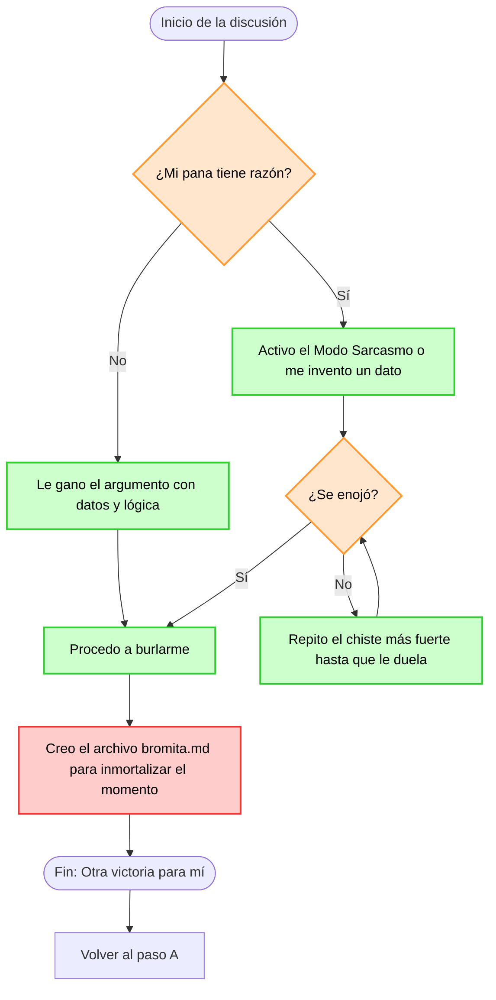

# JIJIJAJA Bromita muchachos

## no dejen sus cuentas abiertas

```mermaid
graph TD
    %% Configuración de Estilos y Colores
    classDef panita fill:#ffcccc,stroke:#ff3333,stroke-width:2px,color:#000;
    classDef burla fill:#ccffcc,stroke:#33cc33,stroke-width:2px,color:#000;
    classDef decision fill:#ffe6cc,stroke:#ff9933,stroke-width:2px,color:#000;

    A([Inicio de la discusión]) --> B{¿Mi pana tiene razón?}:::decision
    
    %% Camino del NO
    B -- No --> C[Le gano el argumento con datos y lógica]:::burla
    C --> F[Procedo a burlarme]:::burla
    
    %% Camino del SÍ (Bucle infinito)
    B -- Sí --> D[Activo el Modo Sarcasmo o me invento un dato]:::burla
    D --> E{¿Se enojó?}:::decision
    E -- Sí --> F
    E -- No --> G[Repito el chiste más fuerte hasta que le duela]:::burla
    G --> E

    %% Desenlace
    F --> H[Creo el archivo bromita.md para inmortalizar el momento]:::panita
    H --> I([Fin: Otra victoria para mí]) --> J[Volver al paso A]

```
